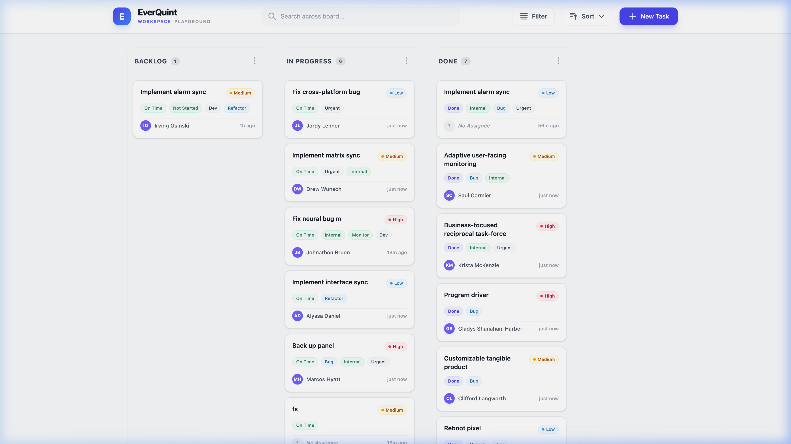
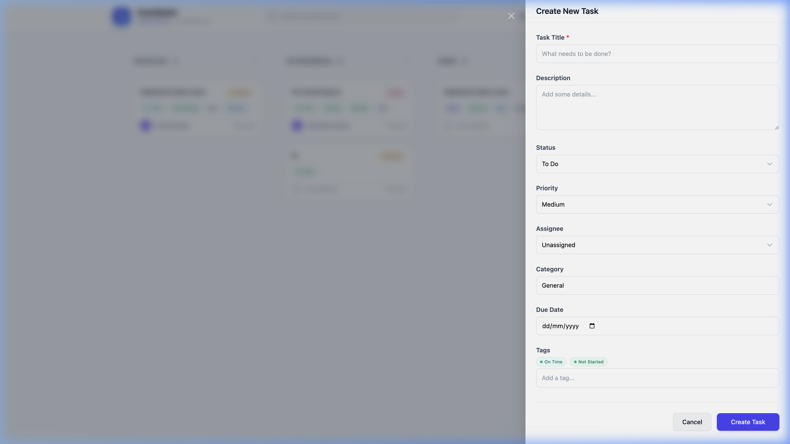
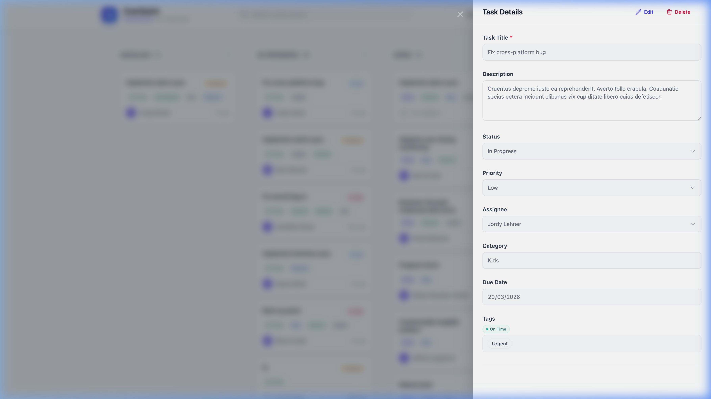
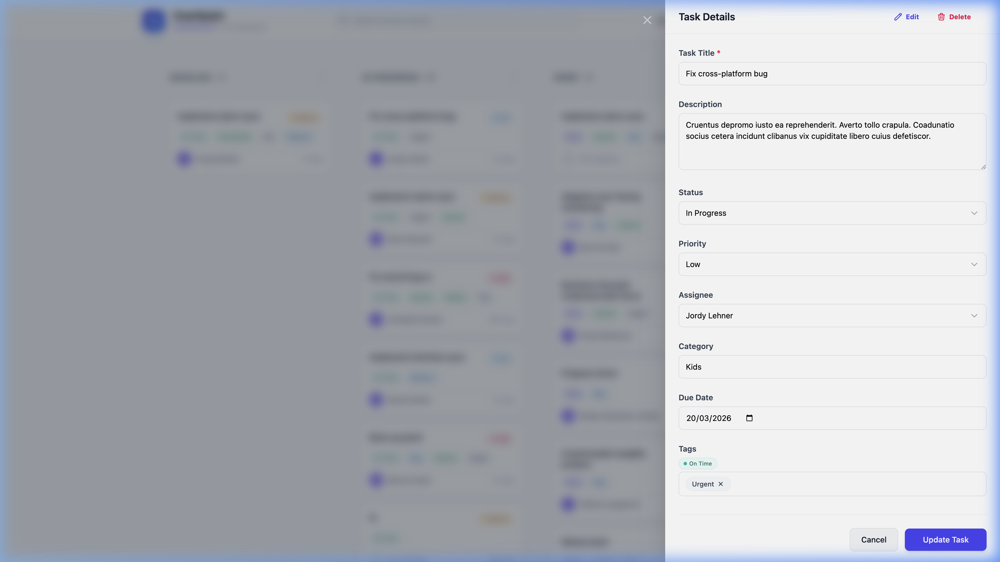
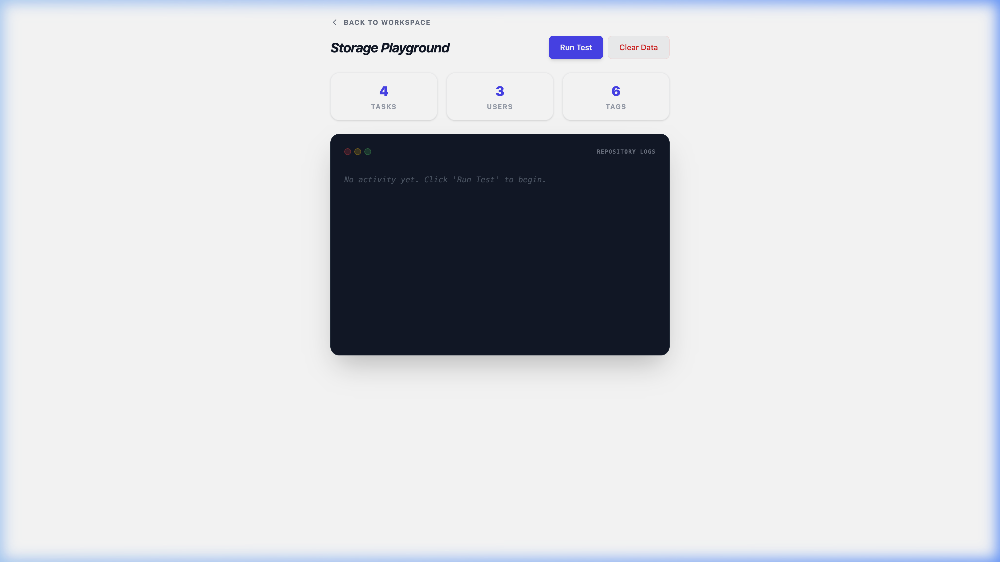

# 📘 EverQuint User Guide

Welcome to EverQuint! This guide will walk you through the core flow of managing tasks, testing the data layers, and organizing your work visually.

### Full Application Walkthrough
Watch the complete user flow in action below:

---

## 1. The Main Workspace
When you first load the application without tasks, you'll be greeted by an empty state Kanban board. Once tasks are generated, the board comes alive with vibrant color-coded tags and computed priority markers (like "Overdue").

*To organize your work, you can click and hold any Card to **Drag and Drop** it between columns (To Do, In Progress, Done). The underlying IndexedDB instantly synchronizes these changes.*

---

## 2. Creating a Task
Clicking the **"New Task"** button in the header triggers a beautifully animated modal overlay on the right side of the screen.

1. **Title & Description**: Fill in the core details.
2. **Priorities & Dates**: Select semantic statuses.
3. **Smart Tags**: As you type in the Tag Editor, existing tags are dynamically suggested. Hit `Enter` to confirm a tag.
4. **Save**: Click "Save" and the panel slides away, immediately reflecting your new task on the board.

---

## 3. Viewing and Navigating Tasks
Clicking directly onto any task card launches the "View Mode" detail modal. This enables quick scanning without the visual density of forms.

Notice the URL? Deep linking means you can copy the URL (`/task/[id]`) and share it directly with a teammate to open this exact view.

---

## 4. Rapid Inline Editing (Double-Click)
EverQuint optimizes for speed. If you spot a typo while reading a task:
1. Simply **double-click** anywhere on the title or description text.
2. The entire view instantly transforms into an **Edit Form**.

Once you hit "Update Task," the form instantly resolves back to the clean, read-only view state.

---

## 5. The Storage Playground (Debug & Mock)
Testing a complex Kanban board manually is tedious. So, we built the Playground.

1. Click **Playground** in the paramount navigation.
2. This dedicated sandbox provides an interface directly into our custom IndexedDB repository.
3. Click "Generate 10 Tasks". The application uses `Faker.js` to intelligently mock highly realistic JSON records (e.g., proper names, balanced random statuses).
4. Click **Back to Workspace**, and your board is instantly populated with a robust dataset to test filtering and dragging mechanics freely.
